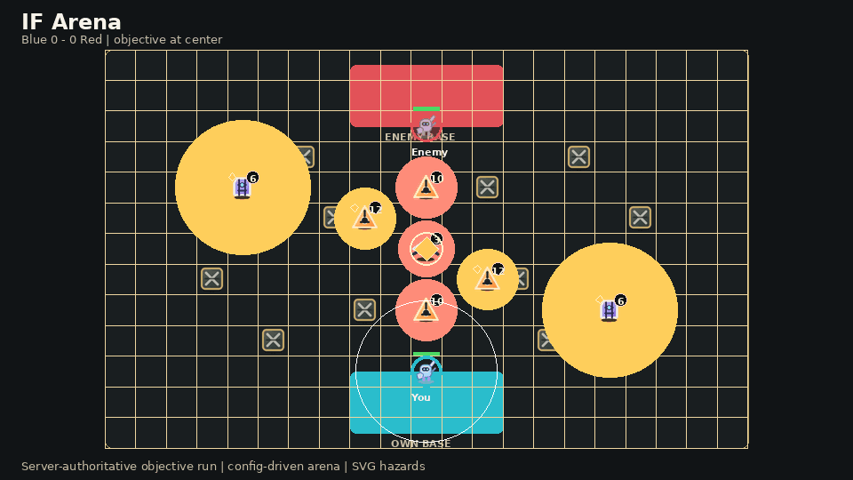
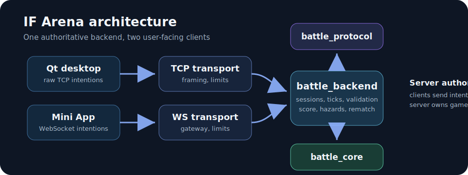

# IF Arena

[](https://github.com/IrinaF0000/if-arena/actions/workflows/pr-ci.yml)

IF Arena is a small real-time 2-player **Objective Run** game. One authoritative C++20 backend runs the match; a Qt desktop client connects over raw TCP, and a Telegram Mini App/browser client connects over WebSocket.





## Gameplay

Two players spawn on opposite sides of a compact arena. The objective starts in the center. A player scores by carrying the objective back to their own base. The first player to score 3 captures wins.

Core rules:

- clients send intentions only: move, aim, attack, dash, create/join, and next match;
- the server owns position, HP, cooldowns, objective state, score, hazards, and match result;
- the carrier moves slower and drops the objective when hit;
- a short pickup lock prevents instant re-pickup after a drop;
- mines, towers, and crows are neutral server-controlled hazards;
- after match over, players can start the next match from the same screen.

## Clients

- **Qt desktop client**: raw TCP, keyboard/mouse input, player-oriented view, right side panel for connection, match state, logs, and controls.
- **Telegram Mini App/browser client**: WebSocket, compact mobile layout, touch controls, collapsible match panel.
- **CLI/load clients**: local smoke and load testing.

Both UI clients render the same server-owned scenario metadata: bases, objective, obstacles, hazards, ranges, damage/drop markers, cooldown state, and visual IDs.

## Architecture

```text
Qt desktop client      -> raw TCP     -> battle_transport_tcp ┐
CLI/load clients       -> raw TCP     -> battle_transport_tcp ├-> battle_backend -> battle_core
Telegram Mini App      -> WebSocket   -> battle_transport_ws  ┘          │
                                                                          └-> battle_protocol
```

Module boundaries:

- `battle_core`: deterministic game rules and value configs only;
- `battle_protocol`: transport-independent DTOs, limits, and validation;
- `battle_backend`: sessions, match workers, authority, metrics, rate limits, and queues;
- `battle_transport_tcp` / `battle_transport_ws`: network adapters;
- clients: input, rendering, interpolation, and local UI feedback only.

## Repository layout

```text
config/scenarios/             Arena and gameplay scenario configs
config/examples/               Local server configs
src/battle_core/               Deterministic simulation library
src/battle_protocol/           Shared protocol DTOs and validation
src/battle_backend/            Authoritative sessions and match loop
src/battle_transport_tcp/      Raw TCP transport
src/battle_transport_ws/       WebSocket transport
src/battle_server_app/         Backend executable
src/battle_qt_client/          Qt Widgets desktop client
frontend/telegram_mini_app/    TypeScript Mini App/browser client
assets/                        Shared SVG gameplay assets
tests/                         Unit, integration, security, load, and scenario tests
scripts/                       CI, run, validation, and helper scripts
docs/                          Architecture, gameplay, operations, and development docs
```

## Scenario config

The default playable scenario is config-owned:

```text
config/scenarios/arena_small_objective_run.json
```

The server loads the scenario config and converts it into value config for `battle_core`. The core does not read files or parse JSON. Clients do not invent map data or gameplay rules.

Gameplay scenario tests are also config-driven:

```text
tests/scenarios/*.json
```

Required validators:

```bash
python scripts/ci/validate_no_hardcoded_scenarios.py
python scripts/ci/validate_gameplay_scenario_pairs.py
python scripts/ci/validate_scenario_map_fairness.py
```

## Build and test

Default C++ build:

```bash
cmake -S . -B build -DBATTLE_BUILD_TESTS=ON
cmake --build build --parallel
ctest --test-dir build --output-on-failure
```

Core smoke checks:

```bash
python tests/integration/server/tcp_vertical_slice_smoke.py
python tests/frontend/websocket_local_smoke.py
```

Gameplay scenarios:

```bash
python tests/integration/desktop/objective_run_full_capture_desktop.py
python tests/integration/mobile/objective_run_full_capture_mobile.py
python tests/integration/desktop/objective_event_sequence_desktop.py
python tests/integration/mobile/objective_event_sequence_mobile.py
python tests/integration/desktop/rematch_same_screen_desktop.py
python tests/integration/mobile/rematch_same_screen_mobile.py
```

Frontend checks:

```bash
node tests/frontend/telegram_protocol_validation.mjs
node tests/frontend/telegram_websocket_client_behavior.mjs
node tests/frontend/telegram_arena_canvas_assets.mjs
node tests/frontend/telegram_main_layout_contract.mjs
cd frontend/telegram_mini_app
npm install
npm run typecheck
npm run lint
npm run build
```

Security and load checks:

```bash
python tests/security/tcp_protocol_negative.py
python scripts/ci/validate_architecture_boundaries.py
python scripts/ci/scan_secrets.py
build/battle_load_client --dry-run --scenario gameplay --clients 20 --duration 30 --command-rate 5 --seed 42 --output reports/load/dry-run-gameplay.md
python tests/load/load_client_dry_run.py
python tests/load/local_tcp_load_scenarios.py --report build/local-tcp-smoke.md
```

## Local run

### Stop old local processes

Before a clean manual test on Windows:

```cmd
scripts\run\stop_if_arena.cmd
```

The launchers call this script by default. It stops old server/client processes and clears local ports `5555`, `8081`, and `5173`. Use `--keep-vite` only when intentionally keeping the Vite dev server running.

### Server

```bash
build/battle_server_app --config config/examples/server.local.json --max-clients 2
```

### Qt desktop client

Windows with Qt MinGW kit:

```powershell
$env:Path = "C:\Qt\6.11.1\mingw_64\bin;C:\Qt\Tools\mingw1310_64\bin;C:\Qt\Tools\Ninja;$env:Path"
cmake -S . -B build-qt-mingw -G Ninja -DCMAKE_BUILD_TYPE=Debug -DBATTLE_BUILD_TESTS=ON -DBATTLE_BUILD_QT_CLIENT=ON -DCMAKE_PREFIX_PATH="C:\Qt\6.11.1\mingw_64"
cmake --build build-qt-mingw --parallel
ctest --test-dir build-qt-mingw --output-on-failure
build-qt-mingw\battle_qt_client.exe
```

### Telegram Mini App/browser client

```bash
cd frontend/telegram_mini_app
npm install
npm run dev
```

Run the backend with WebSocket enabled on `127.0.0.1:8081` and path `/ws`. The local frontend defaults to:

```text
ws://127.0.0.1:8081/ws
```

## Development rules

- `battle_core` stays independent from networking, UI, filesystem, and deployment code.
- Every network message is untrusted and validated server-side.
- Every queue, frame, message, and log surface must have clear bounds.
- Secrets are not committed, logged, or embedded in frontend code.
- Desktop and mobile gameplay scenarios must stay paired.
- New gameplay behavior needs tests and config coverage.

## Current baseline

Current release candidate notes: [`v0.2.1-playable-alpha`](docs/operations/RELEASE_NOTES_v0.2.1-playable-alpha.md).

Create a release tag only after final review.

## Known limitations

- Public hosting is not configured in this slice.
- Raw TCP is for local CLI/Qt/load testing unless deployment rules are added.
- Public Telegram usage requires WSS/HTTPS termination.
- Telegram auth validation exists, but replay protection and production session-token issuance remain follow-up work.
- Larger mixed TCP/WebSocket soaks, snapshot coalescing, and production metrics export are future hardening tasks.
- The Qt target requires a local Qt SDK and is disabled in default non-Qt builds.

## License

This project is licensed under the MIT License. See [`LICENSE`](LICENSE).
