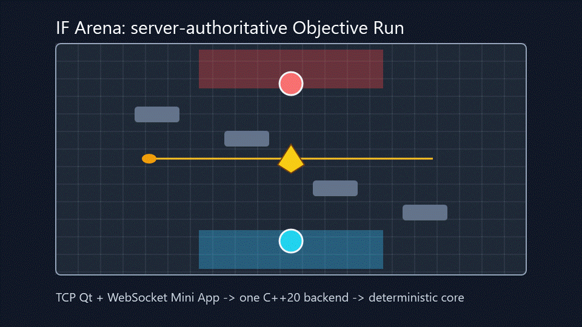

# IF Arena

[](https://github.com/IrinaF0000/if-arena/actions/workflows/pr-ci.yml)

IF Arena is a small real-time 2-player arena game built as a C++20 networking, backend, Qt, Telegram Mini App, security, and agentic-development portfolio project.

The name combines the author's initials, `IF`, with a small programming pun. The project name is intentionally independent of any commercial game platform or brand.



## Quick portfolio review

Start with the checked-in [demo assets and capture notes](docs/demo/README.md), then skim the architecture diagram below and the local smoke commands. The current review target is a local playable alpha/MVP candidate: public hosting is intentionally out of scope, while local TCP, WebSocket, Qt, and Telegram Mini App flows are present.

### What this demonstrates

- C++20 backend structure with an isolated deterministic `battle_core`.
- Server-authoritative gameplay: clients send intentions, never owned state.
- Transport-independent protocol DTOs shared by raw TCP and WebSocket adapters.
- Qt Widgets desktop client and TypeScript Telegram Mini App client.
- Local playable Objective Run flow with hazards, objective capture, combat, and readable UI feedback.
- Focused C++, frontend, browser harness, security, load, and structure checks.
- Agent workflow discipline with scoped task packets, run notes, quality gates, and review roles.

## Product concept

Two players join a short real-time objective arena match. Each player controls one hero. The arena is authored on a logical grid but movement is smooth and real-time.

The MVP mode is **Objective Run**:

- two players spawn on opposite sides of a compact arena;
- an objective starts at the exact center;
- players compete to pick it up and carry it back to their own base;
- the first player to score 3 captures wins;
- the carrier moves slower;
- the carrier drops the objective when hit;
- after a drop, a short pickup lock prevents instant re-pickup;
- neutral server-controlled hazards such as mines, towers, and drones/crows create tactical pressure;
- after a finished match, players can start the next match from the current screen.

The clients do not own game state. They send player intentions such as move, aim, attack, and dash. Objective pickup and capture are server-side automatic rules. The server validates every command and applies accepted commands to the authoritative simulation.

Current hazard behavior is also server-owned and driven by scenario metadata:

- **Mine**: proximity hazard with a visible range; damages a player and can force the carried objective to drop.
- **Tower**: area-control hazard with a larger marked range and cooldown; damages players in range and can force a carrier drop.
- **Crow**: deterministic neutral center-pressure hazard; applies light configured damage/drop pressure near the objective.

Clients render hazard icons, ranges, cooldown/trigger state, and short labels from protocol/config metadata. They must not infer damage, range, drop behavior, or cooldowns from hardcoded hazard names.

Blocking obstacles and hazards are also visualized from server snapshot metadata. The same `visualId`, damage/drop markers, range radius, cooldown state, and neutral/team ownership semantics drive both desktop and Mini App rendering.

## MVP arena requirements

- Recommended MVP map size: **21 x 13 logical cells**.
- One center cell contains the initial objective spawn.
- The arena uses **180-degree rotational symmetry** around the central objective.
- Both players have equal stats and equal start conditions.
- Bases, spawn points, obstacles, hazards, and route options are symmetric.
- The whole arena should fit on screen in the MVP.
- Player movement is smooth; the grid is mostly a level-authoring and collision structure.
- The floor may show a subtle tile/grid pattern, but the game should feel like a top-down real-time arena, not a strict turn-based board game.

## Player-oriented view

The server uses one canonical coordinate system. Clients may render a local player-oriented view:

- each player sees their own base at the bottom of the screen;
- the enemy base appears at the top;
- `W` or forward touch input always means moving toward the center/enemy side in the local view;
- local controls are interpreted in player view and the local TCP backend transforms team-local command directions to canonical world movement;
- replay, spectator, and debug views use canonical orientation.

Player view may use local colors: own hero blue/cyan, enemy hero red. Replay/debug views may use fixed team colors.

## One backend, two UI clients

```text
                    +------------------------+
                    |  battle_server_app     |
                    |  one backend process   |
                    +-----------+------------+
                                |
              +-----------------+-----------------+
              |                                   |
      raw TCP transport                    WebSocket transport
              |                                   |
      Qt desktop client                 Telegram Mini App
      CLI/load clients                   browser/WebView client
```

The Qt client demonstrates C++ desktop UI, Qt networking integration, and low-latency keyboard/mouse gameplay over raw TCP.

The Telegram Mini App demonstrates a lightweight mobile/web UX with invite-based play. Browser-based Mini Apps cannot use raw TCP directly, so they connect through WebSocket. The backend game logic and protocol DTOs remain shared.

The desktop client keeps the arena clear and moves service UI into a right side panel. The Mini App keeps score/objective/scenario status compact, keeps create/join/next controls in a collapsible match panel, and keeps touch gameplay controls reachable below the arena.

## Repository layout

```text
external/battle_simulation_snapshot/
  Empty place for a read-only copy of the original local simulation project.

src/battle_core/
  Static library extracted from the old simulation snapshot.

src/battle_protocol/
  Transport-independent DTOs, schema validation helpers, protocol limits.

src/battle_backend/
  Authoritative application layer: sessions, match manager, workers, command routing,
  metrics, rate limiting, and backpressure policies.

src/battle_transport_tcp/
  Raw TCP transport for Qt, CLI, and load clients.

src/battle_transport_ws/
  WebSocket gateway for Telegram Mini App clients.

src/battle_server_app/
  Executable that starts the backend and enabled transports.

src/battle_qt_client/
  Qt Widgets desktop client.

frontend/telegram_mini_app/
  TypeScript Telegram Mini App frontend.

tools/load_client/
  Simulated client load testing tool.

docs/
  Product, architecture, protocol, security, performance, agent workflow, and game design docs.
```

## Development principles

- `battle_core` must not depend on TCP, WebSocket, Qt, Telegram, deployment, or process-level server code.
- `battle_protocol` must remain transport-independent.
- `battle_backend` owns all game authority, validation, session state, match workers, metrics, and resource limits.
- Transports are adapters, not game-rule owners.
- Qt and Telegram clients are presentation/input layers only.
- Every network input is untrusted.
- Every resource that can grow must have a bound.
- Secrets must not be committed, logged, or embedded in frontend code.
- Agentic implementation must be done in small, reviewable tasks with explicit quality gates.

## Implemented milestones

1. Copy the old project into `external/battle_simulation_snapshot/`.
2. Extract a minimal `battle_core` static library without changing the old repository.
3. Add transport-independent protocol DTOs and validation.
4. Build a headless backend with one local Objective Run match and deterministic tick loop.
5. Add raw TCP transport and CLI client.
6. Add Qt desktop client with player-oriented rendering.
7. Add WebSocket transport and Telegram Mini App.
8. Add load testing, metrics, security hardening, and deployment docs.

## Status

This repository has the foundation modules, an in-process backend match loop, local raw TCP and WebSocket vertical slices, a Telegram Mini App slice, and a Qt Widgets playable client target. Local CLI/TCP, Qt, and Telegram/WebSocket clients can create/join a demo Objective Run match, start the next match from the current screen after match over, send intention-only commands, and receive authoritative snapshots/events from the server.

The tree is a local playable alpha/MVP candidate for review, testing, and portfolio demonstration. Public deployment is still intentionally out of scope: local Qt/TCP and browser/WebSocket flows are supported, while production WSS/HTTPS deployment, public operations, and account/session hardening remain follow-up work.

## Local build and run

Build the default C++ targets:

```bash
cmake -S . -B build -DBATTLE_BUILD_TESTS=ON
cmake --build build --parallel
ctest --test-dir build --output-on-failure
```

Run the local server:

```bash
build/battle_server_app --config config/examples/server.local.json --max-clients 2
```

Before manual desktop or Mini App testing on Windows, clear old local processes:

```cmd
scripts\run\stop_if_arena.cmd
```

Use `scripts\run\stop_if_arena.cmd --keep-vite` only when intentionally keeping the Vite dev server on `127.0.0.1:5173`. The launchers call the stop script by default and write logs/PID files under `build/run-logs/` and `build/run-state/`.

Run a local raw TCP smoke with two CLI clients:

```bash
build/battle_cli_client --create --display-name cli-one --script tests/integration/server/cli_idle.script
build/battle_cli_client --join M1 --display-name cli-two --script tests/integration/server/cli_scenario_b.script
```

Run the Qt desktop client on Windows with the Qt MinGW kit:

```powershell
$env:Path = "C:\Qt\6.11.1\mingw_64\bin;C:\Qt\Tools\mingw1310_64\bin;C:\Qt\Tools\Ninja;$env:Path"
cmake -S . -B build-qt-mingw -G Ninja -DCMAKE_BUILD_TYPE=Debug -DBATTLE_BUILD_TESTS=ON -DBATTLE_BUILD_QT_CLIENT=ON -DCMAKE_PREFIX_PATH="C:\Qt\6.11.1\mingw_64"
cmake --build build-qt-mingw --parallel
ctest --test-dir build-qt-mingw --output-on-failure
build-qt-mingw\battle_qt_client.exe
```

Run the Telegram Mini App locally:

```bash
cd frontend/telegram_mini_app
npm install
npm run dev
```

In another terminal, run `battle_server_app` with a local config that has `transports.tcp.enabled=false` and `transports.websocket.enabled=true` on `127.0.0.1:8081` with path `/ws`. The local frontend defaults to `ws://127.0.0.1:8081/ws`. Browser/Mini App clients use WebSocket; raw TCP remains for Qt, CLI, and load clients.

## Tests and validators

Core/server checks:

```bash
cmake -S . -B build -DBATTLE_BUILD_TESTS=ON
cmake --build build --parallel
ctest --test-dir build --output-on-failure
python tests/integration/server/tcp_vertical_slice_smoke.py
python tests/frontend/websocket_local_smoke.py
```

Config-driven gameplay scenarios:

```bash
python tests/integration/desktop/objective_run_full_capture_desktop.py
python tests/integration/mobile/objective_run_full_capture_mobile.py
python tests/integration/desktop/objective_event_sequence_desktop.py
python tests/integration/mobile/objective_event_sequence_mobile.py
python tests/integration/desktop/rematch_same_screen_desktop.py
python tests/integration/mobile/rematch_same_screen_mobile.py
python scripts/ci/validate_no_hardcoded_scenarios.py
python scripts/ci/validate_gameplay_scenario_pairs.py
python scripts/ci/validate_scenario_map_fairness.py
```

Telegram Mini App frontend checks:

```bash
node tests/frontend/telegram_protocol_validation.mjs
node tests/frontend/telegram_websocket_client_behavior.mjs
node tests/frontend/telegram_arena_canvas_assets.mjs
node tests/frontend/telegram_main_layout_contract.mjs
cd frontend/telegram_mini_app
npm run typecheck
npm run lint
npm run build
```

Load and security smoke:

```bash
build/battle_load_client --dry-run --scenario gameplay --clients 20 --duration 30 --command-rate 5 --seed 42 --output reports/load/dry-run-gameplay.md
python tests/load/load_client_dry_run.py
python tests/load/local_tcp_load_scenarios.py --report build/local-tcp-smoke.md
python tests/security/tcp_protocol_negative.py
python scripts/ci/validate_architecture_boundaries.py
python scripts/ci/scan_secrets.py
```

## Scenario configs

The playable default arena is config-owned:

```text
config/scenarios/arena_small_objective_run.json
```

This file defines the Objective Run map, bases, spawns, objective rules, combat values, hazards, obstacle metadata, tick rate, and snapshot rate. `battle_server_app` loads scenario files and backend code converts them into value config for `battle_core`; `battle_core` remains deterministic and does not read files or parse JSON.

Gameplay test scripts are generic runners. Scenario-specific routes, command sequences, and expected objective events live in:

```text
tests/scenarios/*.json
```

Every gameplay scenario must keep paired desktop and mobile coverage. `validate_no_hardcoded_scenarios.py` guards against duplicating map/routes/events in tests, `validate_gameplay_scenario_pairs.py` checks the desktop/mobile pairing, and `validate_scenario_map_fairness.py` checks map symmetry/fairness constraints.

## Known limitations

- The server is a local portfolio/demo backend, not a production deployment.
- Raw TCP is intended for local CLI/Qt/load testing unless a deployment review adds firewalling, TLS strategy where applicable, and stricter operations controls.
- Telegram auth is backend-validated, but replay protection and production session-token issuance remain follow-up work.
- WebSocket support is local HTTP Upgrade only in this slice; public Telegram usage requires WSS/HTTPS termination.
- Large slow-reader soaks, mixed TCP/WebSocket load, snapshot coalescing, and production metrics export are future hardening tasks.
- Qt target requires a local Qt SDK and is disabled in default non-Qt builds; the Windows MinGW kit command above is the verified path for release stabilization.

## Portfolio Summary

- C++20 authoritative game backend with transport-independent protocol validation.
- Raw TCP and WebSocket local transports with bounded frames/messages and session phase checks.
- CLI, Qt Widgets, and Telegram Mini App clients that send player intentions only.
- Deterministic Objective Run core, backend match loop, and reproducible local smoke/load reports.
- SVG player asset rendering in Qt and Web clients while gameplay remains server-owned.
- Security notes, architecture-boundary validation, secret scanning, scoped agent workflow, and honest release limitations are documented.

## Current release baseline

Current release candidate notes: [`v0.2.1-playable-alpha`](docs/operations/RELEASE_NOTES_v0.2.1-playable-alpha.md).

No release tag should be created until explicitly approved.

## CI/CD safety

PR and main workflows are intentionally separated. PR CI validates C++, TypeScript, repository structure, and secret-scanning without deployment or production secrets. Main CI repeats validation on the merged tree and may build non-sensitive artifacts. Workflow changes are protected by `docs/ci/CI_CD_GUARDRAILS.md`.

## Agent-oriented development harness

This repository includes a scoped agent harness for Codex-style parallel development:

- root and nested `AGENTS.md` files;
- repo-local skills in `.agents/skills/`;
- focused rules in `docs/agent-rules/`;
- task packets in `docs/agent-tasks/`;
- Agent Manager docs in `docs/agent-manager/`;
- scripts for structure, harness, and secret validation.

The harness is designed to keep security, code quality, access boundaries, role separation, scalability, CI/CD safety, and token economy explicit during agent-driven implementation.


## License

This project is licensed under the MIT License. See [`LICENSE`](LICENSE).
