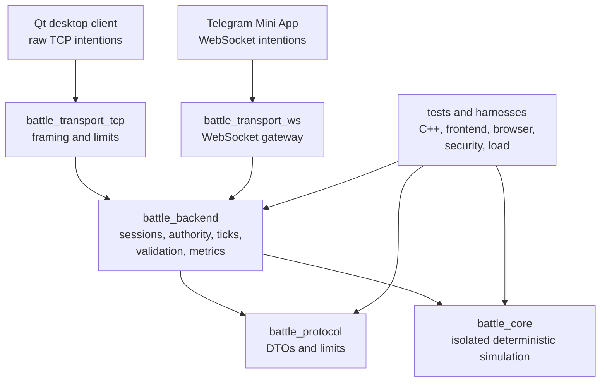

# IF Arena demo assets

This folder is the short portfolio-review path for IF Arena. It keeps demo material separate from source code and avoids deployment assumptions.

## Assets

- `assets/if-arena-demo-loop.gif` - compact Objective Run demo loop for the README top section.
- `assets/if-arena-review-snapshot.png` - static portfolio screenshot for articles, PRs, or profile pages.

The checked-in assets are deterministic portfolio composites that reflect the current playable slice: two players, symmetric arena pressure, objective capture, obstacles, and the neutral crow hazard. For a release post, replace or supplement them with a live runtime capture from the same flow.

## Two-minute review path

1. Open the README and watch the demo loop.
2. Check the "What this demonstrates" list for the engineering surface area.
3. Scan the architecture map below to confirm authority boundaries.
4. Run the local smoke commands from the README if deeper verification is needed.

## Architecture map

## Demo capture checklist

- Start the local server with the README `battle_server_app` command.
- Open the Qt client or Telegram Mini App flow.
- Capture one short Objective Run sequence: join, move toward objective, dash or attack, pickup/drop, capture, match-over state.
- Keep the capture local-first; do not imply public deployment unless WSS/HTTPS deployment has been completed.

## Portfolio claims covered

- C++20 backend and isolated deterministic game core.
- Server authority and intention-only clients.
- Raw TCP and WebSocket transports using shared protocol DTOs.
- Qt desktop and Telegram Mini App presentation/input layers.
- Tests, security checks, load tooling, and agent-run documentation.
