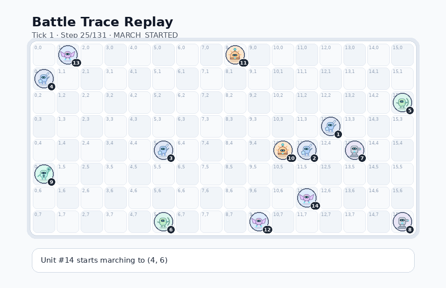
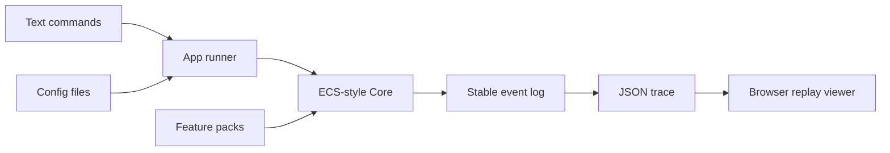

# C++20 Battle Simulation Sandbox

[](https://github.com/IrinaF0000/battle_simulation/actions/workflows/ci.yml)

A compact C++20 architecture sandbox for deterministic turn-based battle simulation.

The project demonstrates modular gameplay runtime design: a domain-neutral ECS-style Core, feature-owned battle mechanics, deterministic scenario execution, JSON trace output, browser replay tooling, and CI-backed regression checks.

It is intentionally small enough to review, but structured like a real engineering project: clear module boundaries, explicit runtime composition, testable behavior, architecture boundary checks, and documented AI-assisted development workflow.



## Demo

The C++ engine emits a deterministic JSON trace that can be replayed in the browser.

- [Open the static replay viewer](https://irinaf0000.github.io/battle_simulation/replay-viewer/)
- [View the sample trace](docs/replay-viewer/traces/basic-battle.json)
- [Read the JSON trace format](docs/json-trace.md)
- [Run the simulator locally](#quick-start)

The online demo is static: it replays traces generated by the C++ engine. The engine itself is built and run locally.

## What This Demonstrates

- C++20 modular architecture with explicit ownership boundaries.
- ECS-style runtime with generic Core infrastructure and feature-owned gameplay.
- Deterministic simulation suitable for replay, regression testing, and debugging.
- Data-driven unit archetypes through a narrow JSON schema.
- Browser-based trace replay without coupling the engine to UI code.
- CMake, CTest, CI, warning-clean presets, and architecture boundary checks.
- Documented AI-assisted development workflow with scoped implementation and verification roles.

## Architecture At A Glance



Core owns generic world/runtime concepts. Feature packs own gameplay rules and unit mechanics. The browser viewer consumes trace output and does not participate in simulation logic.

## Quick Start

```bash
cmake -S . -B build -DCMAKE_BUILD_TYPE=Release
cmake --build build --parallel
ctest --test-dir build --output-on-failure
```

Run a scenario:

```bash
./build/battle_sim commands_example.txt
```

Run with a config file:

```bash
./build/battle_sim commands_example.txt config/default.cfg
```

Generate and inspect a JSON trace:

```bash
./build/battle_sim commands_example.txt --trace-json trace.json
./build/battle_sim inspect trace.json
```

## Browser Replay

Open the live static replay viewer through GitHub Pages:

[Open replay viewer](https://irinaf0000.github.io/battle_simulation/replay-viewer/)

The online viewer runs entirely in the browser. It does not run the C++ engine; it replays a prepared JSON trace generated by the simulator.

The source files for the static demo are stored in:

```text
docs/replay-viewer/
```

The viewer also supports loading any compatible `trace.json` file manually.

For local browser-driven runs, build the simulator and start the helper:

```bash
python tools/local-runner/server.py --exe build/battle_sim
```

Open:

```text
http://127.0.0.1:8765
```

On Windows multi-config builds, pass `build/Debug/battle_sim.exe` or `build/Release/battle_sim.exe` if needed.

## Quality Gates

```bash
ctest --test-dir build --output-on-failure
python scripts/check_architecture_boundaries.py
```

The project includes deterministic scenario tests, ECS behavior tests, golden-output checks, CI validation, and presets for stricter builds such as warnings and sanitizer configurations.

## Documentation

- [Documentation map](docs/README.md)
- [Architecture](docs/architecture.md)
- [Game loop](docs/game-loop.md)
- [Configuration](docs/configuration.md)
- [Data-driven archetypes](docs/data-driven-archetypes.md)
- [JSON trace format](docs/json-trace.md)
- [Deterministic simulation](docs/deterministic-simulation.md)
- [Replay viewer](tools/replay-viewer/README.md)
- [Adding a mechanic](examples/add-new-mechanic.md)
- [AI-assisted development workflow](docs/agent-workflow.md)

## Scope

This is not a full game product. It is a compact C++ architecture sandbox focused on modular runtime design, deterministic simulation, testability, and tooling around trace-based replay.

## License

MIT License.
