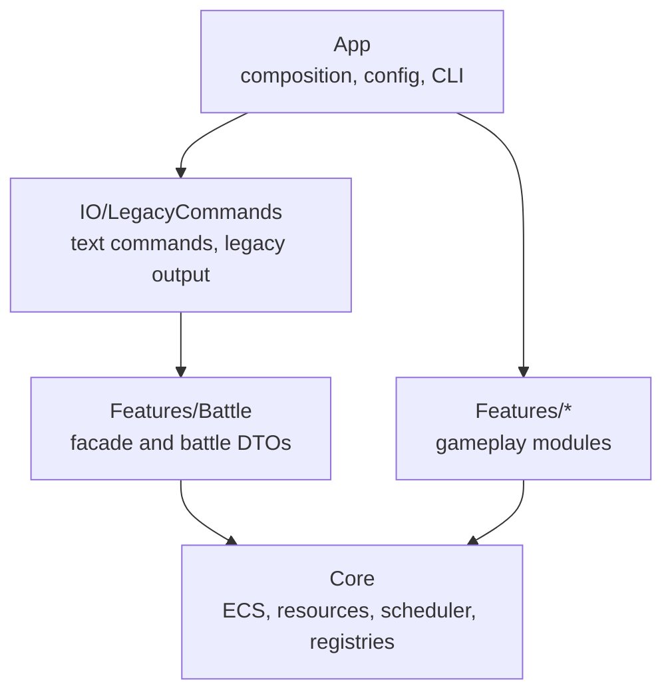

# Architecture

This project is a C++20 turn-based battle simulation with a domain-neutral ECS/engine core and feature-owned gameplay mechanics.

## Modules

- `Core`: ECS storage, resources, scheduler, type-erased event bus, registries, mutation queue, and feature-pack interfaces.
- `Features/Battle`: battle components, battle events, battle map resource, policies, selectors, effects, mutations, and systems.
- `Features/UnitsClassic`: built-in unit archetypes and action-rule recipes.
- `IO/LegacyCommands`: text scenario parser, command DTOs, and legacy text-output adapter.
- `App`: CLI entry point, scenario runner, config loading, and feature-pack wiring.

## Runtime flow

```text
text commands
  -> App scenario runner
  -> feature-pack runtime assembly
  -> IO command handlers
  -> BattleSimulationFacade
  -> EngineRunner / Scheduler
  -> Features/Battle systems
  -> Core ECS/resources/registries/mutations/event bus
  -> battle events
  -> legacy output adapter and optional JSON trace
```

## Boundary direction



`Core` provides reusable infrastructure. Gameplay headers and concepts are owned by feature modules:

- battle components are in `Features/Battle/Components`;
- battle event DTOs are in `Features/Battle/Events`;
- battle map and movement rules are in `Features/Battle/Resources`, `Policies`, and `Systems`;
- battle entity recipes and archetypes are in `Features/Battle` and `Features/UnitsClassic`.

The CLI keeps the legacy text command syntax and `UNIT_*` output format as an IO compatibility surface. Runtime gameplay uses feature-owned Battle systems over the generic Core infrastructure.

The architecture boundary checker in `scripts/check_architecture_boundaries.py` enforces the main include rules in CI.

## Related docs

- `docs/deterministic-simulation.md`
- `docs/game-loop.md`
- `docs/system-order.md`
- `docs/configuration.md`
- `docs/data-driven-archetypes.md`
- `docs/json-trace.md`
- `docs/performance-notes.md`
- `examples/add-new-mechanic.md`
